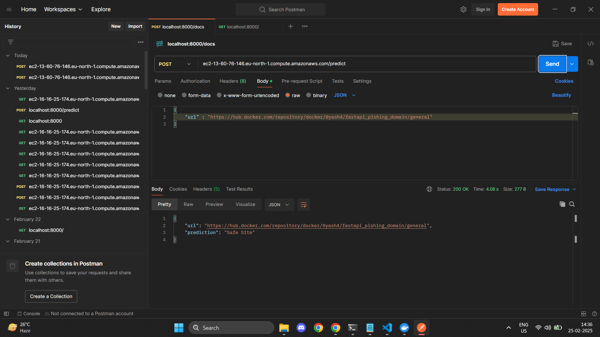

# Phishing Domain Detection

## Overview
This project aims to detect phishing domains using a custom-built pipeline that extracts 111 features from a given URL. The extracted features provide a detailed analysis of the URL structure, domain attributes, directory patterns, file naming conventions, and external service interactions.

## Features
I have created a custom pipeline to extract 111 features from a given URL. Below are the feature categories and the specific attributes extracted:

### Table 1: Dataset attributes based on URL
1. qty_dot_url - Number of '.' signs
2. qty_hyphen_url - Number of '-' signs
3. qty_underline_url - Number of '_' signs
4. qty_slash_url - Number of '/' signs
5. qty_questionmark_url - Number of '?' signs
6. qty_equal_url - Number of '=' signs
7. qty_at_url - Number of '@' signs
8. qty_and_url - Number of '&' signs
9. qty_exclamation_url - Number of '!' signs
10. qty_space_url - Number of ' ' signs
11. qty_tilde_url - Number of '~' signs
12. qty_comma_url - Number of ',' signs
13. qty_plus_url - Number of '+' signs
14. qty_asterisk_url - Number of '*' signs
15. qty_hashtag_url - Number of '#' signs
16. qty_dollar_url - Number of '$' signs
17. qty_percent_url - Number of '%' signs
18. qty_tld_url - Top-level domain character length
19. length_url - Number of characters
20. email_in_url - Is email present (Boolean: 0 or 1)

### Table 2: Dataset attributes based on domain URL
1. qty_dot_domain - Number of '.' signs
2. qty_hyphen_domain - Number of '-' signs
3. qty_underline_domain - Number of '_' signs
4. qty_slash_domain - Number of '/' signs
5. qty_questionmark_domain - Number of '?' signs
6. qty_equal_domain - Number of '=' signs
7. qty_at_domain - Number of '@' signs
8. qty_and_domain - Number of '&' signs
9. qty_exclamation_domain - Number of '!' signs
10. qty_space_domain - Number of ' ' signs
11. qty_tilde_domain - Number of '~' signs
12. qty_comma_domain - Number of ',' signs
13. qty_plus_domain - Number of '+' signs
14. qty_asterisk_domain - Number of '*' signs
15. qty_hashtag_domain - Number of '#' signs
16. qty_dollar_domain - Number of '$' signs
17. qty_percent_domain - Number of '%' signs
18. qty_vowels_domain - Number of vowels
19. domain_length - Number of domain characters
20. domain_in_ip - URL domain in IP address format (Boolean: 0 or 1)
21. server_client_domain - 'server' or 'client' in domain (Boolean: 0 or 1)

### Additional Features
The dataset also includes features extracted from:
- URL directory structure
- URL file name attributes
- URL parameters
- URL resolving metrics and external services (e.g., Google search index, domain activation time, TLS/SSL certificate validation, etc.)

The dataset consists of two variations:
1. A balanced dataset with 58,645 instances (30,647 phishing, 27,998 legitimate)
2. An imbalanced dataset with 88,647 instances (30,647 phishing, 58,000 legitimate)

## Artifacts
- **AWS Proof**: 
- **Project Demo Video**: 
  
## Repository
Check out the project repository: [Phishing Domain Detection](https://github.com/0yash4/Pishing-domain-detection)

## Author
I am a full-time Technical Recruiter and a part-time Machine Learning Engineer/ Data Scientist. I dedicate 2-4 hours daily to ML/DS projects while balancing my full-time job. In my free time, I enjoy fitness, longevity research, and reading (currently working through *Crime and Punishment*). I also have a deep interest in psychology and communication. 

## Contact
Feel free to reach out for collaboration or discussion on cybersecurity and ML applications!

---

This README provides an in-depth look at my project and my role in its development. Let me know if you need further improvements!
